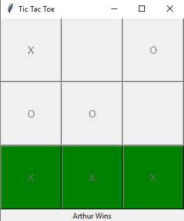

# Tic Tac Toe 🔥
--------------------------------------------------
## About:
The famous game of Tic Tac Toe is known to everyone and if you don't know check out the [Rules and Scoring](Rules.md) to understand the game better. Tic Tac Toe or Noughts and Crosses as called in British is a pencil and paper game for two player. The player who succed in placing three of their marks in a single line either horizontally, vertically or diagonally wins the game.
In this Repository we make the game using Tkinter in Python. Here two human are playing against each other and the first one to go gets "X" and the second one gets "O".
For beginners to python, Tkinter is a GUI framework for Python that allows for buttons, graphics and alot of other things to be done in a window.
--------------------------------------------------
## Demo:

--------------------------------------------------
## Contributors:
#### [List of Contributors](Contributors/README.md)
--------------------------------------------------
### Want to Contribute but Stuck?
### Check [How to Contribute](how_to_contribute.md)
--------------------------------------------------
### New To GitHub??
* [Intro to GitHub](https://youtu.be/wTTek8P2VB4)
* [How to Create a Repository](https://youtu.be/o6T5F7-SOAo)
* [Cloning a Repository](https://youtu.be/oYselL5G280)
* [Contributing to a Project](https://youtu.be/4vq07q7g2xE)
--------------------------------------------------
## If you find this Repository Interesting and Helpful do leave a 🌟 or contribute. 😄
